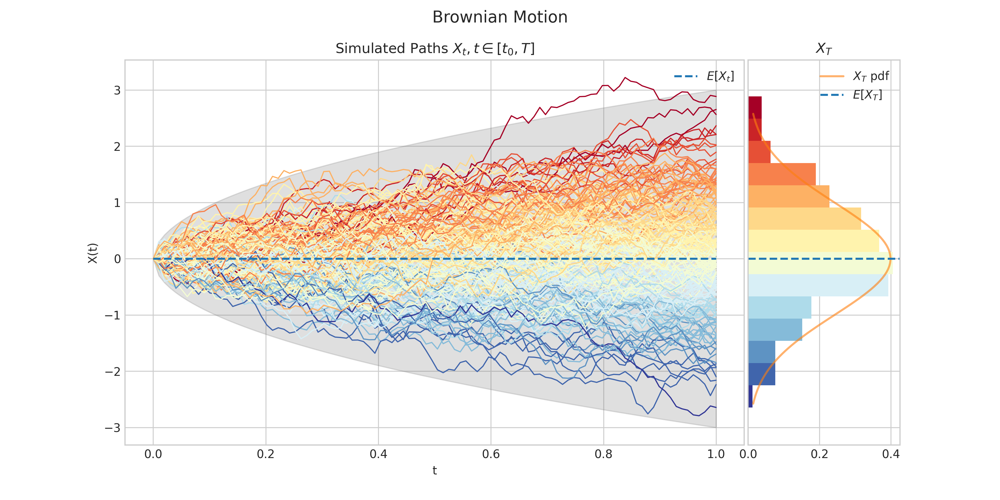

<!-- ### “Grid is the very first CSS module created specifically to solve the layout problems we've all been hacking our way around for as long as we've been making websites.”

*— [Chris House, A Complete Guide to CSS Grid Layout](http://chris.house/blog/a-complete-guide-css-grid-layout/)* [^1]

--- -->

### Overview

Aleatory (/ˈeɪliətəri/) introduces objects representing stochastic processes, and provides functionality to:

- generate realizations/trajectories of each process over discrete time sets
- create visualisations to illustrate the processes properties and behaviour





<!-- --- -->

<!-- ### <dfn title="Ermahgerd is a humorous version of the phrase oh my god, written as though pronounced with a heavy influence of extra Rs. It's meant to imitate the sound of someone speaking through a retainer.">ERMAHGERD</dfn>

A proper grid is what we always wanted, no ... _needed_ to build websites with a solid, unbreakable structure. And that's why I used it in this theme. I call this feature a "scaffold" because none of the _content_ is laid out on this grid. Only the main _structure_: consisting of the `header`, `footer`, `main`, `aside`, and `footer`. As you can tell by this quote from the [W3C](https://www.w3.org/TR/css-grid-1/) on the candidate recommendation itself, Grid is the perfect tool for the job: -->

<!-- > ##### CSS Grid Layout Module
>
> This CSS module defines a two-dimensional grid-based layout system, optimized for user interface design. In the grid layout model, the children of a grid container can be positioned into arbitrary slots in a predefined flexible or fixed-size layout grid.
>
> — _W3C_

CSS Grid is a total game changer, IMHO. Compared to the bottomless pit of despair that is the old way, the new way of building a site structure can be done in as little as 5 lines of CSS. Of course, it always takes more than that, but not much. I mean this is really the meat of the deal:

```css
.grid-container {
  display: grid;
  grid-template-columns: repeat(6, 1fr);
  grid-template-rows: repeat(3, auto);
}
```

#### What an amazing time to be a web developer. Anyway, I hope you enjoy this "feature" that you'll probably never notice or even see. Maybe that's the best part of a good user interface – the hidden stuff that just works.

[^1]: The original article cited here is now updated and maintained by the staff over at CSS-Tricks. Bookmark their version if you want to dive in and learn about CSS Grid: [A Complete Guide to Grid](https://css-tricks.com/snippets/css/complete-guide-grid/) -->
